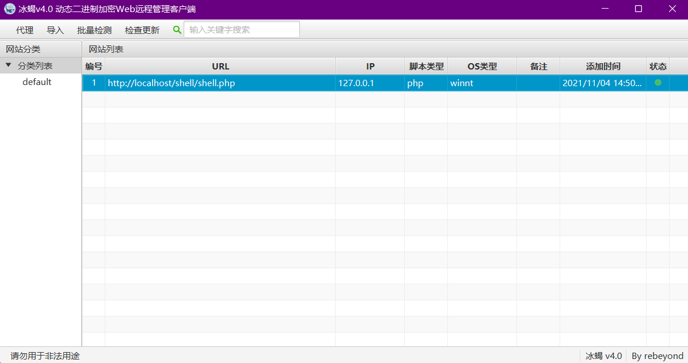
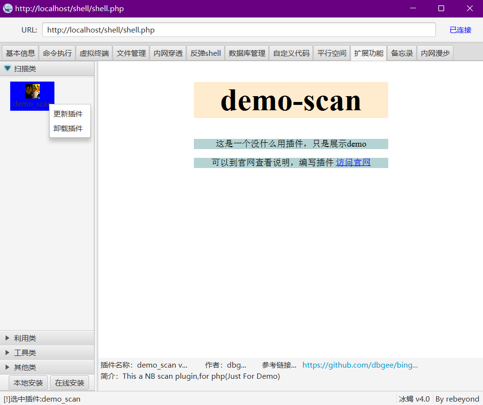

# 冰蝎
开源版 冰蝎 v4.0

## 简介
一款平台通用shell 管理工具

## 运行
> 两种运行方式  
> 运行环境要求：jre1.8+ 

1. 下载已经编译好的jar 文件 [bingxie-v4.0](https://github.com/dbgee/bingxie/releases/tag/v4.0)
，直接运行  
` java -jar bingxie-v4.0.jar `
2. 下载源码,本地编译运行
    1. 下载代码到本地 `git clone https://github.com/dbgee/bingxie && cd bingxie `
    2. 编译打包 `mvn -DskipTests package`
    3. 运行 ` java -jar bingxie-v4.0-jar-with-dependencies.jar `

## 变更日志
1. 新增“内容漫步” 功能
2. 调整“检查更新” 逻辑，由自动更新变为手动可控
3. 优化启动入口，方便组件安装
4. 新增日志输出，方便排错调试
5. 新增插件功能 [目前demo 展示中](https://github.com/dbgee/bingxie/wiki#%E6%8F%92%E4%BB%B6%E5%8A%9F%E8%83%BD%E4%BD%BF%E7%94%A8) 

## TODO
- 优化内网漫步功能
- 增加混淆模块
- 完善插件功能，增加实际功能（也欢迎各位提交插件）

## 代码贡献
1. Fork 本项目到自己的github 账号下
2. Clone 自己的项目代码到本地
3. 在本地修改代码（修复bug、新增功能）
4. push 到自己的项目代码下
5. PR (pull requests) 到本项目

## 运行截图
1. 系统首页截图
  

2. 插件页面截图
